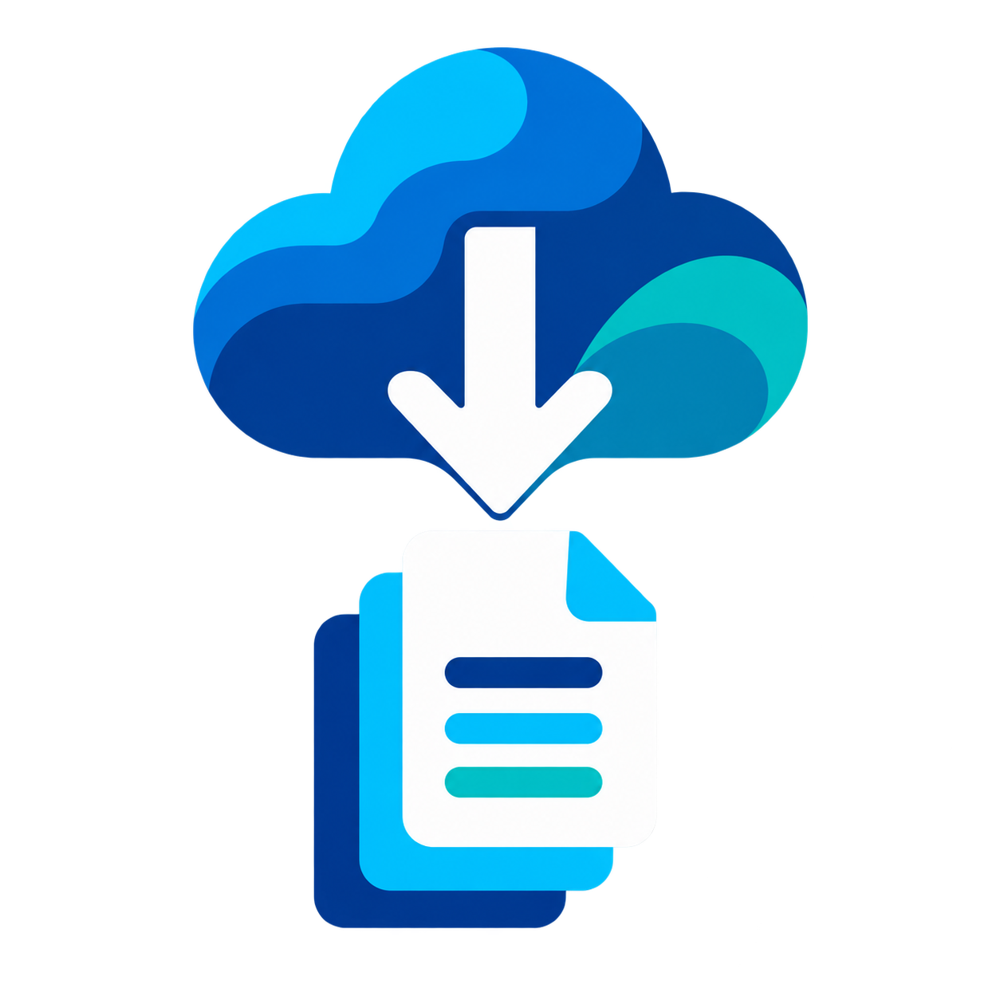

# GCS Pull

	

GCS Pull is an Obsidian desktop plugin for previewing and downloading files from Google Cloud Storage into a vault. Google Cloud Storage is always the source: the plugin contains no remote upload or delete operation.

GCS Pull is an independent community plugin and is not affiliated with or endorsed by Google or Obsidian.

## Installation

Install **GCS Pull** from **Settings → Community plugins**.

## Safety behavior

- **Preview changes** shows exactly how many remote files will be downloaded before writing anything.
- A persistent progress notice shows file-count completion and percentage during a manual pull.
- New remote files are downloaded into the configured vault folder.
- A remote-only update replaces the local file without creating an unnecessary backup.
- If both the local file and its remote generation changed, the local content is preserved as a timestamped `.conflict-*` backup before replacement.
- Safe pull retains a local edit while the remote generation remains unchanged.
- Safe pull retains local files when their remote objects are deleted.
- Ambiguous, unsafe, or colliding remote paths are rejected.
- Configured bucket folders can be excluded from previews, manual pulls, and automatic pulls.
- The vault configuration directory is always excluded.

## Pull behavior

**Safe pull** is the default. It downloads new and remotely updated files while retaining local edits and files whose remote objects were deleted.

**Mirror tracked files** uses GCS as the source of truth only for files previously pulled by this plugin. It backs up and replaces local edits, and moves tracked files to Obsidian's configured trash when their remote objects are deleted. Local-only and excluded files are never removed. Manual mirror changes require confirmation. Destructive automatic pulls require a separate opt-in.

## Requirements

- Obsidian 1.13.0 or newer on desktop.
- A Google account with access to the source bucket.
- A Google Cloud project with the Cloud Storage JSON API enabled.
- A Google OAuth client with application type **Desktop app**.

## Set up Google

1. Create or select a project in Google Cloud Console.
2. Enable the Cloud Storage JSON API.
3. Configure the OAuth consent screen and add your Google account as a test user when the app is in testing mode.
4. Create an OAuth client with application type **Desktop app**.
5. In Obsidian, open **Settings → GCS Pull**.
6. Enter the OAuth client ID and secret, then select **Connect**.
7. Enter the bucket name, optional object prefix, excluded folders, and vault-relative destination folder.
8. Select **Preview** and review the counts before selecting **Pull from GCS**.

Excluded folders are relative to the configured object prefix. Enter one folder per line or separate folders with commas. For example, with the object prefix `vault/`, excluding `archive/` skips objects below `vault/archive/`. Folder matching is case-sensitive.

The OAuth flow uses a temporary `127.0.0.1` callback with PKCE and state validation. It requests Google's `devstorage.read_only` scope.

## Tracking

The settings tab records separate counts for:

- scanned remote files;
- excluded remote files;
- files to pull;
- new files;
- updated files;
- local edits to replace;
- tracked files to move to trash;
- unchanged remote generations;
- expected and created conflict backups;
- already-current content;
- completed and deferred destructive changes; and
- all errors, while displaying the first 20 details.

## Network and privacy disclosure

The plugin requires a Google account and makes direct requests to:

- `accounts.google.com` for user authorization;
- `oauth2.googleapis.com` for OAuth tokens; and
- `storage.googleapis.com` for listing and downloading GCS objects.

The bucket name, object names, OAuth token, and download requests are sent directly to Google because they are required to read the configured bucket. There is no third-party relay, advertising, analytics, or telemetry.

The OAuth client ID, client secret, refresh token, settings, and pull baseline are stored in `.obsidian/plugins/gcs-pull/data.json` for this vault. Treat this file as sensitive and do not commit or share it. The plugin does not access files outside the vault.

## Commands

- **Preview changes** — scan and calculate changes without writing files.
- **Pull files** — scan again and apply the current remote generations.

## License

MIT. See [LICENSE](LICENSE).
